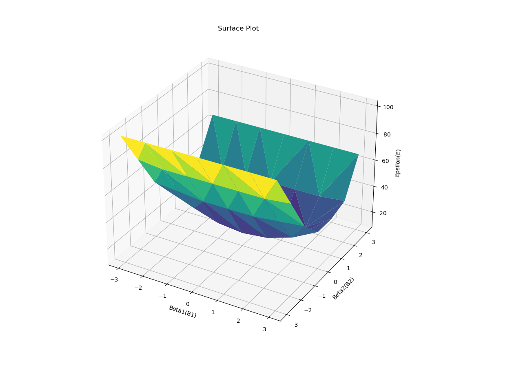

# Polynomial Regression Error Surface Plot

## Overview

This repository contains code to perform a polynomial regression analysis and visualize the error surface using a 3D plot. The code iterates over different values of the coefficients \( \beta_1 \) and \( \beta_2 \) for a polynomial model to find the combination that minimizes the sum of absolute errors between the predicted and actual values.

## Code Description

The code performs the following steps:

1. **Data Initialization**: Defines the arrays `X` and `Y` which contain the input and output data points, respectively.
2. **Parameter Initialization**: Initializes lists to store different values of \( \beta_1 \), \( \beta_2 \), and the corresponding errors.
3. **Parameter Iteration**: Iterates over a range of values for \( \beta_1 \) and \( \beta_2 \), calculates the model predictions, and computes the sum of absolute errors for each combination.
4. **Error Minimization**: Finds the combination of \( \beta_1 \) and \( \beta_2 \) that results in the minimum error.
5. **3D Surface Plot**: Creates a 3D plot to visualize the error surface as a function of \( \beta_1 \) and \( \beta_2 \).

## Results

The code prints the minimum error value and the corresponding coefficients \( \beta_1 \) and \( \beta_2 \).

## Output

Below is an example of the 3D surface plot generated by the code:

## Dependencies

- `numpy`
- `matplotlib`
