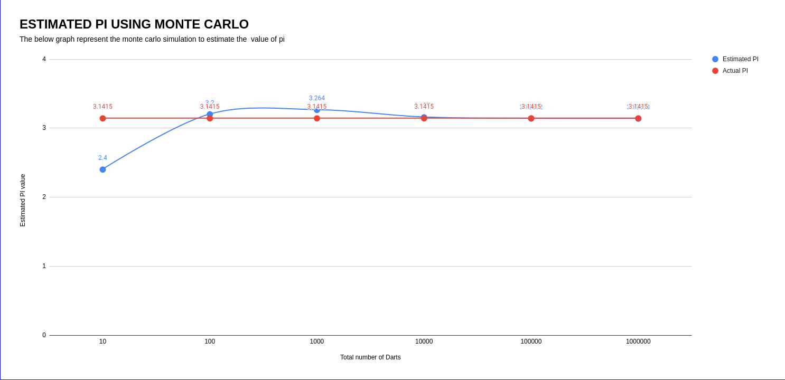

# Monte Carlo Simulation to Estimate π (Pi)

## Overview

This repository contains a Python script that uses the Monte Carlo method to estimate the value of π (pi). The code performs multiple simulations with increasing numbers of random points (darts) and plots the estimated value of π against the number of darts used. Additionally, it smooths the resulting curve using a moving average.

## Code Description

The code performs the following steps:

1. **Define Functions**:
   - `incircle(a, b)`: Checks if a point (a, b) lies within a quarter circle of radius 0.5.
   - `check(n)`: Simulates `n` darts thrown randomly within a unit square and calculates the proportion that fall within the quarter circle.
   - `moving_average(data, window_size)`: Computes the moving average of a list of data points.

2. **Simulation**:
   - Iterates over a list of increasing numbers of darts (`n`).
   - For each number of darts, it calculates the estimated value of π and stores the results.
   - Smooths the estimated values using a moving average.

3. **Visualization**:
   - Plots the smoothed estimated values of π against the number of darts using a logarithmic scale for the x-axis.
   - Adds annotations and a horizontal line representing the actual value of π for comparison.

## Results

The estimated values of π for different numbers of darts are printed to the console and visualized in the plot.

## Output

Below is an example of the plot generated by the code:

## Dependencies

- `numpy`
- `matplotlib`

