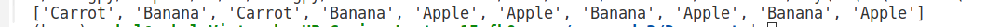

# Probability Mass Function Sampling

## Overview

This folder contains a Python function `drawSamples` that performs sampling from a discrete probability mass function (PMF). The function generates random samples based on the provided PMF and returns a list of sampled items.

## Code Description

The `drawSamples` function takes two parameters:
- `pmf`: A dictionary representing the probability mass function where keys are the items and values are their corresponding probabilities.
- `n`: An integer specifying the number of samples to draw.

The function performs the following steps:
1. **Cumulative Mass Function (CMF) Calculation**: Calculates the cumulative probabilities based on the provided PMF.
2. **Sampling**: Generates `n` random numbers between 0 and 1 and maps them to items based on the CMF.
3. **Output**: Returns a list of sampled items.

## Output

Below is an example of the output generated by the `drawSamples` function:



## Dependencies

- `numpy`

## Usage

To use the `drawSamples` function:
1. Import the function into your Python script or notebook.
2. Provide a dictionary representing the PMF and the number of samples (`n`) as parameters.
3. Call the function to obtain the sampled items.

### Example

```python
import numpy as np

def drawSamples(pmf: dict[str, float], n: int) -> list[str]:
    cmf=[]
    samples=[]
    keys=list(pmf.keys())
    s=0
    for i in pmf.values():
        s+=i
        cmf.append(s)
    for i in range(n):
        randomNum=(np.random.uniform(0,1))
        j = 0
        while randomNum > cmf[j]:
            j += 1
        samples.append(keys[j])
    return samples
        
pmf = {'Apple': 0.5, 'Banana': 0.3, 'Carrot': 0.2}
n = 10
print(drawSamples(pmf, n))
