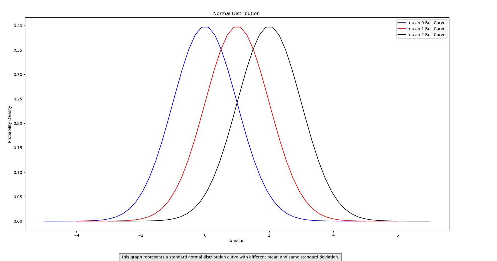

# Normal Distribution Visualizations

This repository contains Python scripts for visualizing normal distributions with different mean and standard deviation parameters.

## Code Descriptions

### 1. Visualization of Normal Distributions with Different Mean Values

The script `normal_distribution_mean.py` visualizes three normal distributions with mean values of 0, 1, and 2, respectively, all with a standard deviation of 1. The distributions are plotted on the same graph to compare their shapes.

### 2. Visualization of Normal Distributions with Different Standard Deviation Values

The script `normal_distribution_std.py` visualizes three normal distributions with a mean value of 0 and standard deviation values of 1, 2, and 3, respectively. The distributions are plotted on the same graph to compare their shapes.

## Output Images

### 1. Normal Distributions with Different Mean Values



### 2. Normal Distributions with Different Standard Deviation Values

.png)

## Dependencies

- `numpy`
- `matplotlib`

## How to Run

1. Make sure you have Python installed along with the required libraries (`numpy` and `matplotlib`).
2. Clone this repository to your local machine.
3. Navigate to the repository directory.
4. Run each script separately:
   - For the first visualization, run:
     ```sh
     python normal_distribution_mean.py
     ```
   - For the second visualization, run:
     ```sh
     python normal_distribution_std.py
     ```

5. The visualizations will be displayed, showing the normal distribution curves.
