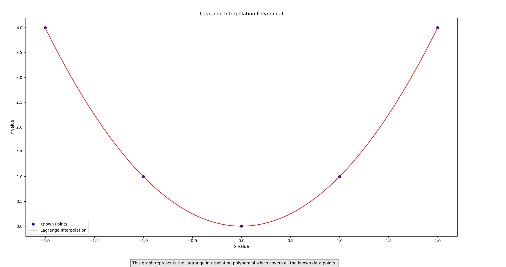

# Polynomial Regression and Lagrange Interpolation

This repository contains Python scripts for polynomial regression and Lagrange interpolation.

## 1. Lagrange Interpolation

The script `lagrange_interpolation.py` implements the Lagrange interpolation method to interpolate points between known data points. It visualizes the known data points and the interpolated curve using the Lagrange interpolation polynomial.

## Output Image



## 2. Polynomial Regression

The script `polynomial_regression.py` performs polynomial regression on randomly generated data. It generates 101 x-values in the range (-5,5) and calculates y-values based on a polynomial function. The script then fits different polynomial models (linear, quadratic, cubic, and biquadratic) to the data using linear regression and plots the models along with the actual data points.

## Output Images

The script `polynomial_regression.py` produces two output images:

1. Plot of Different Models: This image shows the plot of the biquadratic polynomial and 101 x-values in the range (-5,5) with generated y-values for different models such as linear, quadratic, cubic, and Lagrange interpolation.

.png)

2. Bias-Variance Tradeoff Graph: This image shows the bias-variance tradeoff for models such as linear, quadratic, cubic, and biquadratic. It compares the training error (bias) and testing error (variance) for different model complexities.

.png)

## Dependencies

- `numpy`
- `matplotlib`

## How to Run

1. Make sure you have Python installed along with the required libraries (`numpy` and `matplotlib`).
2. Clone this repository to your local machine.
3. Navigate to the repository directory.
4. Run each script separately:
   - For Lagrange Interpolation, run:
     ```sh
     python Buddi5.py
     ```
   - For Polynomial Regression, run:
     ```sh
     python Buddi5(2).py
     ```

5. The visualizations will be displayed.
