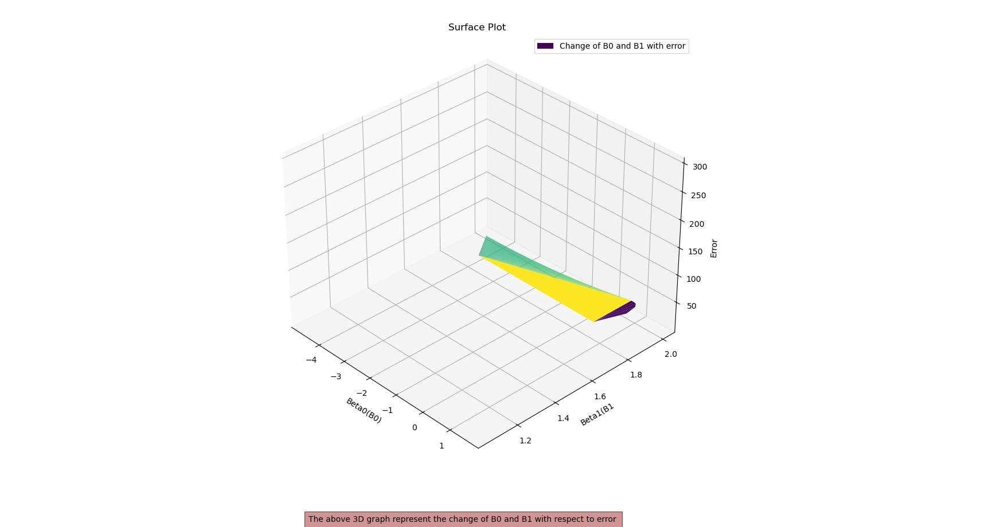

# Gradient Descent

This folder contains Python code examples demonstrating various gradient descent algorithms for linear regression.

## Introduction

Gradient descent is a fundamental optimization algorithm used in machine learning and statistics for minimizing the error of a model by iteratively adjusting its parameters. In the context of linear regression, gradient descent is employed to find the coefficients of a linear equation that best fits a given dataset.

This repository provides implementations of different variants of gradient descent for linear regression, along with visualizations to understand their behavior and performance.

## Algorithms Implemented

### 1. Buddi6.py

#### Description
This script implements gradient descent for linear regression and compares it with the closed-form solution. It visualizes the convergence of error and the change in coefficients over epochs.

#### Output
- 
- 
- 

### 2. Buddi6(2).py

#### Description
This script showcases gradient descent using scikit-learn and evaluates its performance on a randomly generated dataset. It plots the error convergence over epochs for both training and testing data.

#### Output
- .png)

### 3. Buddi6(3).py

#### Description
This script implements stochastic gradient descent for linear regression and evaluates its performance on a random dataset. It visualizes the error convergence over epochs for both training and testing data.

#### Output
- .png)

### 4. Buddi6(4).py

#### Description
This script demonstrates minibatch gradient descent for linear regression. It calculates the coefficients using both closed-form and gradient descent methods and compares the error convergence over epochs.

#### Output
- .png)

## Usage

Each script can be run independently to understand and experiment with the respective gradient descent algorithm. Simply execute the Python script in your preferred environment.

