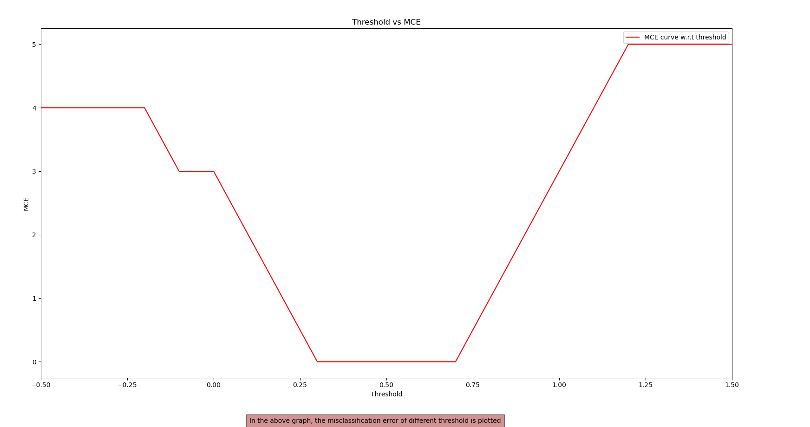

# Linear Regression with Decision Boundary

## Description:
This project implements linear regression to classify two classes of data points with a sigmoidal decision boundary. The decision boundary is perpendicular to the regression line.

## Installation:
- This code requires Python 3.
- Required libraries: numpy, matplotlib.

## Usage:
1. Clone the repository:

2. Navigate to the project directory:

3. Run the code:

## Code Explanation:
- `indicator(Y)`: Converts class labels to indicator variables (1 for class 'B', 0 for class 'G').
- `discriminant(x, threshold)`: Classifies a value based on a given threshold.
- `fit_linear_regression(a, Y)`: Fits a linear regression model to the data.
- `threshVsMce(X, slope, intercept)`: Plots the threshold vs misclassification error curve.
- `calculate_value(x_new)`: Calculates the value of sigmoid and y for a given x using the regression line equation.

## Results:

.png)
