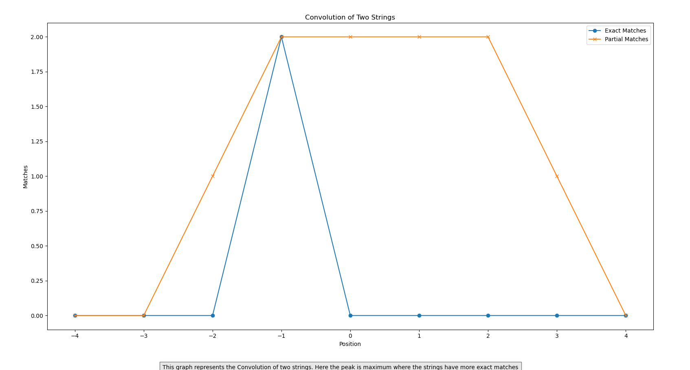

# Convolution of Two Strings - README

## Overview
This assignment demonstrates a simple convolution operation on two strings, counting exact and partial matches between the words of the strings. The results are plotted using `matplotlib` to visualize the match positions.

## Prerequisites
Ensure you have the following Python packages installed:
- `matplotlib`

You can install the necessary package using pip:
```bash
pip install matplotlib
```

## Code Description
The script is composed of the following sections:

1. **Importing Libraries**:
   - `matplotlib.pyplot` for plotting the results.

2. **Function Definition**:
   - `convolution(s1, s2)`: This function takes two strings as input and computes the exact and partial matches between them.
     - It splits the strings into lists of words.
     - It initializes lists to store exact and partial match counts.
     - It performs two nested loops to count exact and partial matches for each word in the strings.
     - It prints the match lists and the positions for visualization.
     - It returns the positions, exact matches, and partial matches for plotting.

3. **Example Strings**:
   - `s1` and `s2` are two example strings provided for convolution.

4. **Performing Convolution**:
   - Calls the `convolution` function with the example strings.

5. **Plotting Results**:
   - Plots the exact and partial match counts against their positions using `matplotlib`.

## Usage
To use the script, you can modify the strings `s1` and `s2` with your own strings and run the script. The plot will visualize the exact and partial matches between the two strings.


## Explanation of the Plot
- **X-axis (Position)**: Positions where the convolution was calculated.
- **Y-axis (Matches)**: Number of exact or partial matches.
- **Exact Matches**: Number of words that exactly match between the two strings at each position.
- **Partial Matches**: Number of words from the second string that are present in the first string at each position.

The plot helps visualize where the two strings have more exact and partial matches, with peaks indicating higher matches.


## Results:

.png)


## Conclusion
This script provides a basic example of string convolution, counting exact and partial word matches, and visualizing the results using a line plot. Modify the example strings to see how different inputs affect the convolution results.
